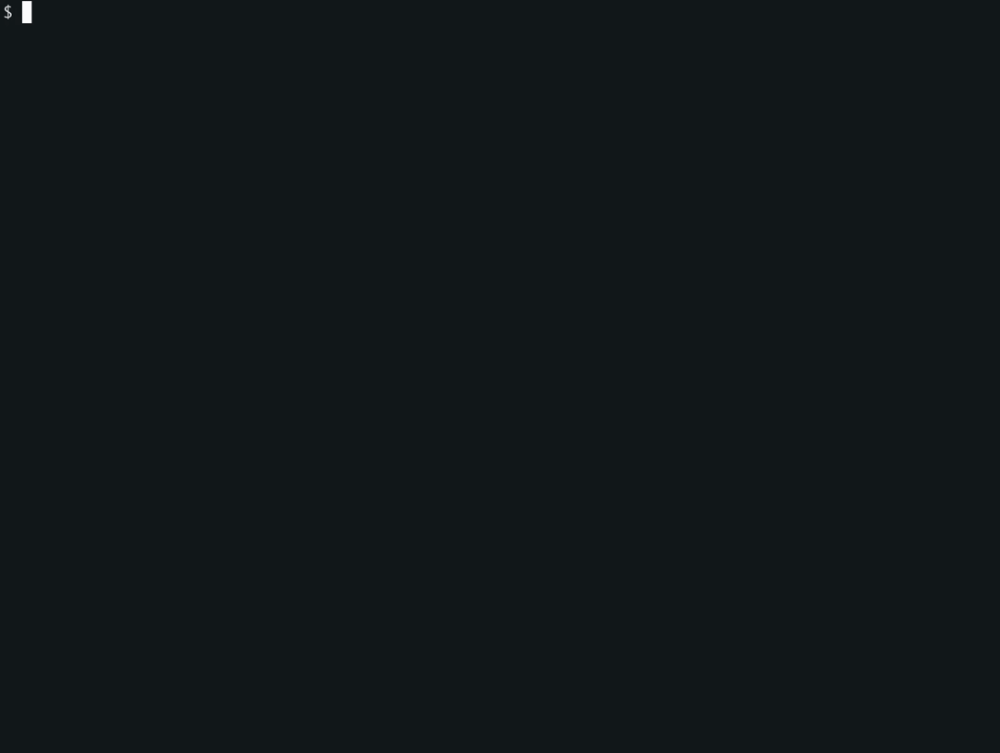

# Ghost Security Poltergeist

High-performance secret scanner for source code, using [Vectorscan/Hyperscan](https://github.com/VectorCamp/vectorscan) for fast multi-pattern matching. Poltergeist is designed to be easy to use by humans and AI agents alike. For AI agent integration, see [Ghost Security Skills](https://github.com/ghostsecurity/skills).



## Quick Start

Supports Linux, macOS, and Windows (via Git Bash, MSYS2, or Cygwin).

```bash
curl -sfL https://raw.githubusercontent.com/ghostsecurity/poltergeist/main/scripts/install.sh | bash
```

Alternatively, download a release directly from [GitHub Releases](https://github.com/ghostsecurity/poltergeist/releases).

As a Go library:

```bash
go get github.com/ghostsecurity/poltergeist
```

## Comprehensive Documentation

Full documentation, tutorials, and video guides at [ghostsecurity.ai](https://ghostsecurity.ai).

## Contributions, Feedback, Feature Requests, and Issues

[Open an Issue](https://github.com/ghostsecurity/poltergeist/issues/new) per the [Contributing](.github/CONTRIBUTING.md) guidelines and [Code of Conduct](.github/CODE_OF_CONDUCT.md)

## Acknowledgments

We'd like to thank the following projects for providing inspiration for Poltergeist and doing tremendous work in the secret scanning space:

- [trufflehog](https://github.com/trufflesecurity/trufflehog)
- [noseyparker](https://github.com/praetorian-inc/noseyparker)
- [kingfisher](https://github.com/mongodb/kingfisher)
- [gitleaks](https://github.com/gitleaks/gitleaks)

## License

This repository is licensed under the Apache License 2.0. See [LICENSE](LICENSE) for details.
